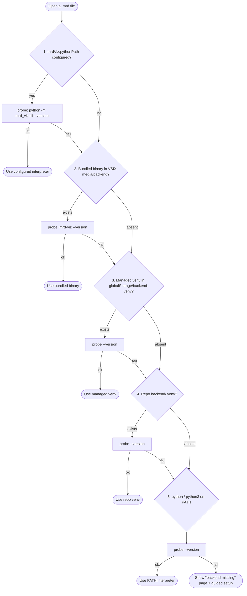
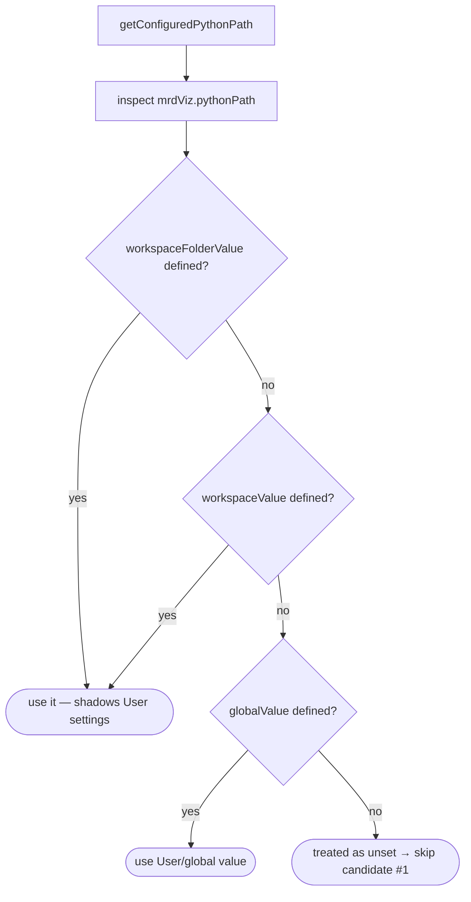
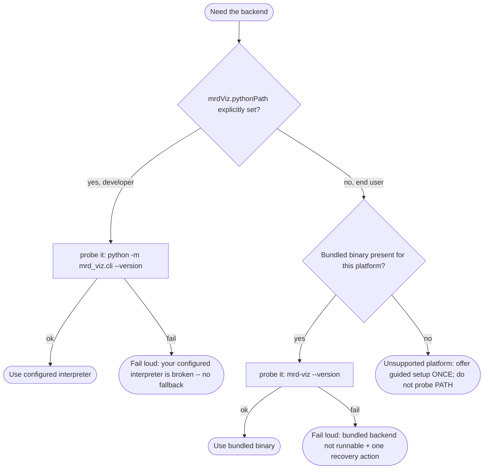
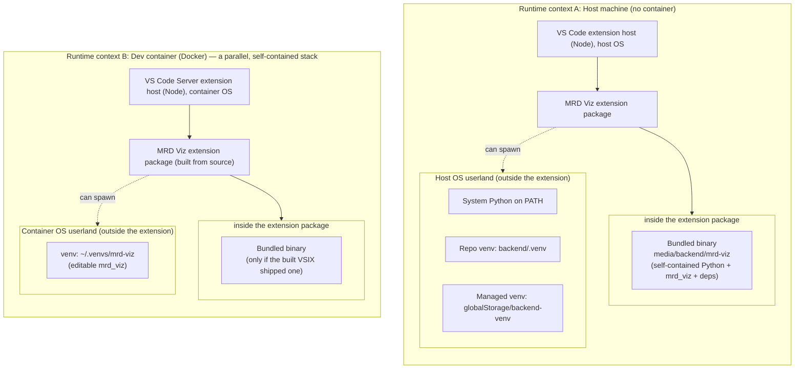

# MRD Viz Backend Install Modes & Interpreter Resolution

How the MRD Viz extension finds a working backend across the four ways it can be installed, which
Python interpreter actually runs, and the open questions around interpreter-precedence (issue #3).
The first half documents the **pre-refactor** behavior (historical context); [Target architecture (implemented)](#target-architecture-implemented)
at the end describes the shipped, deterministic design.

Related runbooks:

- [Extension Release Runbook](EXTENSION_RELEASE_RUNBOOK.md) — how the VSIX is released (GitHub Release vs. Marketplace).
- [Packaging & Local Install Runbook](PACKAGING_AND_INSTALL_RUNBOOK.md) — build/install a VSIX locally.
- [Dev Container](DEVCONTAINER.md) — the containerized setup.

## Distribution channels (three separate things)

These are independent and often confused:

| Channel | Ships what | User action | Notes |
|---|---|---|---|
| **VS Code Marketplace** | the extension (VSIX) | one-click Install | not wired up yet; see the release runbook |
| **GitHub Release** | the extension (VSIX) | download + `code --install-extension` | already implemented |
| **PyPI** | the Python **backend** (`pip install mrd-viz`) | pip, inside a venv | **not published** — so `pip install mrd-viz` currently 404s |

**Decision:** ship the backend as a **bundled binary inside the VSIX** (PyInstaller), so end users need
neither PyPI nor a local Python. PyPI/`pip install` stays a fallback for source/dev workflows only.

## The four install modes

| Environment | Extension source | Backend source (recommended) | Resolver candidate that fires |
|---|---|---|---|
| **Dev container** | built from repo (`just container-setup`) | editable install of `mrd-viz/backend` into `~/.venvs/mrd-viz`, referenced by `mrdViz.pythonPath` | **#1** configured path |
| **Local repo (F5 / contributor)** | F5 Extension Development Host, built from source | repo `backend/.venv` | **#4** repo venv (or **#1** if configured) |
| **Local, released VSIX, no repo** | Marketplace / GitHub Release VSIX | **bundled binary in the VSIX** | **#2** bundled binary |
| **Restricted / air-gapped** | any | pre-provisioned venv, or bundled binary | **#2** or **#3** |

> The hidden dependency today: modes that "just work" for contributors rely on the repo checkout
> (candidate #4) or a dev-container-provisioned venv (candidate #1). A plain released VSIX has
> **only** candidate #2 (bundled binary) or a user-provisioned venv (#3) — which is why the bundled
> binary must be the canonical end-user backend.

## Interpreter resolution order

`resolveBackend()` in [`backendResolver.ts`](../extension/mrd-viz/src/backendResolver.ts) probes each
candidate with `--version` and uses the first that responds. Anything above candidate #5 is an
**explicit path** — ambient `python` on `PATH` is only ever used as the last resort.



## Which Python actually runs — and the scope trap (issue #3)

Candidate #1 comes from `getConfiguredPythonPath()`, which reads `mrdViz.pythonPath` via
`inspect()` and takes the **first defined** of:

```
workspaceFolderValue  ??  workspaceValue  ??  globalValue
```

The dev container sets `mrdViz.pythonPath` through `customizations.vscode.settings`, so a
workspace-scoped value **shadows anything the user sets in User (global) settings**.



### Consequences observed

- A user overriding `mrdViz.pythonPath` in **User** settings is silently ignored inside the dev
  container (the workspace value wins).
- "Set Up Backend Automatically…" builds a working managed venv but **never writes its path to any
  settings scope**, so the resolver only reaches it (candidate #3) by *falling through* a probe
  failure of the stale configured path.
- The extension's managed venv (`globalStorage/backend-venv`) and the dev container's venv
  (`~/.venvs/mrd-viz`) are **two different environments** that don't know about each other.

### Yulia's proposed fix

1. Use `configuration.get<string>('pythonPath')` (respects VS Code's normal precedence) instead of
   hand-rolling the `inspect()` fallback.
2. Have `provisionManagedBackend` write the managed venv path to `Global` at the end, so the guided
   flow leaves settings self-documenting.

### ⚠️ Trap to investigate before implementing

`mrdViz.pythonPath` declares `"default": "python"` in
[`package.json`](../extension/mrd-viz/package.json). So `configuration.get<string>('pythonPath')`
**never returns `undefined`** — when unset it returns the default `"python"`. That would make
resolver **candidate #1 always fire with `"python"`**, collapsing candidates #2–#4 (bundled binary,
managed venv, repo venv) unless `"python"` happens to fail its probe.

Options to reconcile precedence **and** preserve the candidate ladder:

- **(a)** Remove the `"default": "python"` (make it absent/`null`) and switch to `get()`. Cleanest;
  unset then means "skip candidate #1" and normal precedence applies.
- **(b)** Keep `inspect()` but treat the package.json default as "not configured," and also read the
  Remote/machine scope the dev container actually writes to.

Also open: whether writing the provisioned venv to `Global` inside a dev container could **leak a
container path back to the host** (if Global settings are shared), so the write may need to target
the environment-appropriate scope (Machine/Remote in a container, Global on host).

### Open boundary questions (host vs. container, store vs. dev build)

- **Do I uninstall the Marketplace build to debug my changes?** For **F5 (Extension Development
  Host)**: no — the dev host runs your source copy and disables the installed one for that window.
  For **installing a locally built VSIX** into normal VS Code: effectively yes — VS Code won't run
  two extensions with the same `publisher.name`; installing the VSIX replaces the Marketplace one
  (bump the version or use a separate `--profile` to avoid the clobber).
- **Unify the two venvs?** Pointing the dev container at the same managed venv the extension
  provisions (one source of truth per environment) would remove most of the "which Python is used"
  ambiguity and pairs naturally with fix #2 above.

---

# Target architecture (implemented)

> **Status:** implemented in the deterministic-resolution change (`mrdViz.backendPath`, two-tier
> resolver, machine scope). The first half of this document is retained as historical context for
> the pre-refactor 5-candidate behavior.

Everything above documents the **pre-refactor** state. This section describes the shipped design.

## Why the current search is scattered

The five-candidate ladder is a fossil record of the development process, not a design. Each
environment the extension was built in added its own candidate, and the resolver became the *union*
of every workflow's needs, probed linearly at runtime:

| Candidate | Added while working in… |
|---|---|
| #1 `mrdViz.pythonPath` | the **dev container** (point at `~/.venvs/mrd-viz`) |
| #2 bundled binary | the **released VSIX** (end users with no Python) |
| #3 managed venv (globalStorage) | **guided setup** recovery |
| #4 repo `backend/.venv` | the **local F5** contributor loop |
| #5 `python` / `python3` on PATH | catch-all "maybe something runs" |

Blind linear search trades a clear *early* failure for a confusing *late* one: it silently selects
*something*, that candidate passes its `--version` probe, and then it fails at actual use. This is
the root of both the "which Python is actually used?" confusion and the issue #2/#3 bugs.

## The requirement is two audiences, not five environments

Once you split by *who* is running the backend, the environments collapse to two contracts:

1. **End users** (installed VSIX): must work with **zero config and no local Python**. Should never
   see `mrdViz.pythonPath`.
2. **Backend developers** (F5, dev container): are *editing the Python*, so they must point at their
   **editable source**; a frozen binary would defeat the purpose.

## The single source of truth already exists

- **Logically** there is one backend: the Python package at `mrd-viz/backend`.
- **For end users**, its distributable form is the **PyInstaller binary** — Python + deps baked in,
  needs nothing on the host. CI already builds it per-platform and ships it *inside* each VSIX at
  `media/backend/mrd-viz[.exe]`. Nothing is copied at runtime; the binary rides along in the
  extension's own directory, so the extension knows exactly one path, environment-independent.

So the per-platform binaries are frozen builds of a single logical source (the package). That is the
source of truth for end users; the editable package is the source of truth for developers.

## What "probe" means

To **probe** a candidate is to *run* it with `--version` under a short timeout and require exit
code 0 — not merely check that the file exists:

- bundled binary → `mrd-viz --version`
- interpreter → `python -m mrd_viz.cli --version`

A successful probe proves the backend is actually importable/runnable (it catches a broken venv, a
wrong-arch or wrong-glibc binary, or a missing `mrd_viz` module) *before* the extension commits to
it. This is the existing `validateBackend()` step — the redesign keeps it, but applies it to at
most two candidates instead of five.

## The selection signal: presence of `mrdViz.pythonPath`

The setting itself distinguishes the two audiences:

- **Set** → a backend developer who wants their editable checkout/venv. Use it; **fail loud** if it
  is broken (never silently fall back).
- **Unset** → an end user. Use the **bundled binary**; never probe `PATH` or auto-provision silently.

> ⚠️ **Precondition (issue #3 trap):** `mrdViz.pythonPath` currently declares `"default": "python"`,
> so "unset" is indistinguishable from the literal string `python`. This default must be removed (or
> treated as unset) for *absence* to reliably mean "end user." Consider renaming to
> `mrdViz.backendPath` and accepting either an interpreter or a binary path.

## Proposed resolution: deterministic, fail-loud



Rules:

- **Default = bundled binary.** No setting, no search, for the common case.
- **`mrdViz.pythonPath` = explicit developer/power-user override**, set once. The dev container keeps
  doing exactly this, so it is not a special case — just a configured developer.
- **Drop #3/#4/#5 as always-on candidates.** No repo-`.venv` autodiscovery, no `python`/`python3`
  PATH probing, no silent managed-venv fallback.
- **Guided setup is demoted** from "candidate #3" to an **explicit recovery command**, offered only
  when there is no bundled binary for the platform. It is no longer part of normal resolution.
- **Every failure is loud and names exactly one next action.**

## Install modes under the new model

| Environment | `mrdViz.pythonPath` | Backend used |
|---|---|---|
| Local, released VSIX (end user) | unset | **bundled binary** |
| Dev container | set → `~/.venvs/mrd-viz` | that editable venv |
| Local repo / F5 (contributor) | set → `backend/.venv` | that editable venv |
| Unsupported platform / no binary | unset | guided-setup recovery (explicit, one-time) |

## Preconditions & open questions

1. **Linux glibc (blocker).** Making the bundled binary the default requires the manylinux_2_28
   build (repo follow-up #2), or Linux end users have no working default. Fix this first.
2. **Override naming.** Keep `mrdViz.pythonPath`, or introduce `mrdViz.backendPath` that accepts an
   interpreter *or* a binary? Removing the `default: "python"` is required either way.
3. **Dev container.** Treat it purely as "a developer using the override"; stop provisioning a
   managed venv as a hidden runtime candidate.
4. **Binary size.** Each per-platform VSIX carries a PyInstaller bundle (tens of MB). Acceptable for
   the zero-config guarantee?

## Levels of abstraction — where each backend actually lives

The terms `local`, `venv`, `dev container`, and `VSIX` get conflated because they are **not the same
kind of thing**. They sit on three independent axes:

| Axis | Question it answers | Values |
|---|---|---|
| **Runtime context** | *Where does code run?* | host machine · dev container (Docker) |
| **Backend delivery** | *Where does the Python backend come from?* | system Python · venv · **bundled binary** |
| **Extension delivery** | *How did the extension get installed?* | F5 dev host · local VSIX · Marketplace |

The extension-delivery axis is orthogonal — it only decides how the "MRD Viz extension" box below
got onto disk. The structural picture is about the other two: a **runtime context** contains an
extension host, the extension contains an *optional* bundled binary, and the same context *also*
contains external Python environments the extension could spawn.



**How to read it (outer → inner):**

1. **Runtime context** is the outermost boundary. The host and the dev container are *parallel*
   copies of the same stack, **not** one inside the other for our purposes: nothing crosses the
   boundary. A host venv is invisible in the container and vice-versa — which is exactly why a host
   `mrdViz.pythonPath` that leaks into a container fails with `ENOENT` (the Windows path doesn't
   exist in Linux).
2. **Extension host** (Node) runs *within* a context — on the host normally, or inside the container
   (VS Code Server) when you "Reopen in Container."
3. **The extension package** sits inside the extension host. How it got there (F5 / VSIX /
   Marketplace) is the orthogonal delivery axis and doesn't change this shape.
4. **The backend** is reached one of two ways:
   - **Bundled binary** — a whole Python environment *collapsed into one file that lives inside the
     extension package*. Self-contained; travels with the VSIX.
   - **External Python env** — a `venv` or system Python in the *same context's* OS userland,
     *outside* the extension, which the extension spawns.

That inside-vs-outside distinction is the crux: the bundled binary is the only backend that is part
of the extension itself; every venv/system-Python option is an external dependency of whichever
context you happen to be in.

> The [proposed resolution](#proposed-resolution-deterministic-fail-loud) deliberately consults only
> **two** of these boxes — the external Python env *if* `mrdViz.pythonPath` is set (developer), or the
> bundled binary inside the extension (end user). Every other box in this picture is intentionally
> ignored, which is what makes "which Python is used?" answerable.
