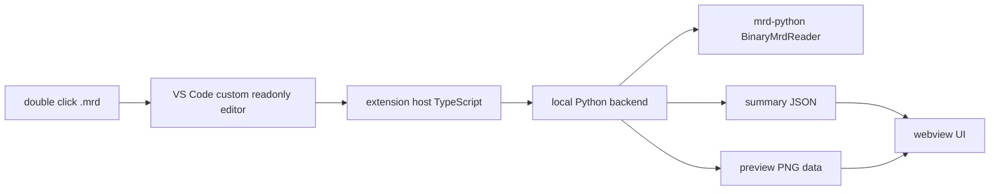

# MRD Viz Technical Design

Status: In Progress
Owner: Carter Capetz
Last updated: 2026-06-23

## Purpose

This doc is the working technical design for `mrd-viz`, a VS Code extension and Python-backed inspection layer for MRD files.

Use it to:

- explain why the tool is needed
- define the smallest useful software shape
- cite the scripts, libraries, and local implementation patterns the project will build from
- log open questions and design decisions
- keep extension, webview, and Python backend boundaries clear

## Background

### Team overview and why an MRD viewer is needed

The Monarch team is building the initial test rollout of low-field MRI machines. The goal is to make MRI more accessible by developing scanners that are lower cost and more portable than conventional high-field systems. That goal introduces engineering challenges across hardware control, acquisition workflow design, reconstruction, image quality, and autonomous operation.

Low-field MRI produces lower-fidelity images, so the broader project depends on reliable experimentation and image-improvement workflows. Over time, the system should support increasingly autonomous operation: agents should be able to run acquisition and reconstruction workflows, optimize sequence choices, inspect outputs, and eventually help translate new MRI techniques from research papers onto the specific scanner hardware.

MRD is the file format used in this project ecosystem to support typed, stream-oriented MRI data exchange. That matters for low-field workflows because the scanner itself should not be expected to run every image-processing step locally; MRD gives the system a way to hand off acquisition and reconstruction artifacts to local or cloud processing while preserving MRI-specific structure.

The current tooling gap is inspection. Researchers and engineers can generate scripts or quick visualizers, but those tools are fragmented, ad hoc, and inconsistent. Some users need a quick view to decide whether a dataset is worth using as training input. Others need to classify many MRD files at once, compare slices, inspect acquisition patterns, or run lightweight image heuristics. `mrd-viz` should become the unified inspection surface for those workflows, starting with a dependable file-first viewer.

### MRD file structure overview

MRD files should be understood as one header followed by a stream of typed items. The important logical components are:

- Header: acquisition and reconstruction context, especially encoding-space matrix size, reconstructed-space matrix size, field of view, encoding limits, and acquisition metadata needed to interpret k-space organization.
- Acquisitions: raw complex-valued k-space readouts. In the MRD Python model, acquisition data is shaped like `[coils, samples]` and carries flags plus encoding counters such as slice, phase, contrast, repetition, and k-space encode steps.
- Images: reconstructed image-domain arrays. In the MRD Python model, image data is shaped like `[channel, z, y, x]` and carries image metadata such as image type, series index, slice, phase, contrast, repetition, field of view, channels, and slices.
- Waveforms: physiological or external signal streams such as ECG, pulse oximetry, or triggers. These are not the Stage 1 visualization target, but the data model should count and preserve awareness of them.

This structure means raw and reconstructed MRD files require different viewing modes. Raw MRD is not directly viewable like a normal image; it is better inspected through k-space magnitude, phase, sampling density, encoding counters, and acquisition flags. Reconstructed MRD is more directly renderable because it already contains image-domain data. Stage 1 will prioritize reconstructed MRD files while keeping raw-file classification and simple acquisition summaries in the backend contract.

### Relationship to HDF5 and ISMRMRD

HDF5, ISMRMRD, and MRD should not be treated as interchangeable terms.

- HDF5 is a hierarchical storage container. It can store large arrays and metadata, but it does not define MRI semantics by itself.
- ISMRMRD v1 is the older MRI raw-data standard that uses HDF5 plus an XML header/schema and fixed binary-style acquisition and image headers.
- MRD is the newer typed, stream-oriented standard and SDK ecosystem. It keeps the same conceptual model of header, acquisitions, images, and waveforms while making binary and NDJSON streams first-class serializations, with optional HDF5 support where useful.

Stage 1 should target MRD binary files through `mrd-python`. Legacy HDF5/ISMRMRD compatibility should be acknowledged as a future compatibility risk, but it should not expand the first build scope. The MRD repository includes `ismrmrd_to_mrd.py`, which can convert ISMRMRD streams or ISMRMRD HDF5 datasets into MRD streams; Stage 1 can document that companion workflow without embedding conversion in the viewer.

## Scope

In scope:

- Stage 1
    - build a VS Code plugin so double clicking a `.mrd` file opens a readonly preview panel
    - render reconstructed MRD image data as a mosaic of thumbnail tiles, where each tile represents one MRD image stream item
    - support lazy loading of a selected tile at larger/full resolution for detailed inspection
    - classify files as raw, reconstructed, mixed, unknown, or invalid based on stream contents rather than filename conventions
    - show a compact metadata side panel with header summary, stream counts, image metadata, and acquisition metadata
    - summarize raw-only MRD files without attempting raw acquisition visualization
    - support the known reconstructed example files before broadening to less common variants
- Stage 2
    - support multiple images within one `.mrd` file with richer navigation
    - support richer metadata display, including grouped metadata sections instead of only unstructured dumps
    - support working with multiple `.mrd` files in one UI session
    - support comparison-oriented views for slices, image types, and related datasets
- Stage 3
    - leave room for run-aware integration, batch classification, acquisition-pattern inspection, lightweight image heuristics, and workflow observability
    - do not design Stage 1 around full scanner control or live workflow monitoring

Out of scope for now:

- direct scanner control
- live workflow monitoring in Stage 1
- QC heuristics or classification models in Stage 1 and Stage 2
- direct runtime dependency on `tinker/` or `monarch/`
- turning the extension into a scanner control surface
- legacy HDF5/ISMRMRD viewing in Stage 1

## Product Surface

### Why a VS Code plugin

`mrd-viz` will be a VS Code plugin because the initial users are technical researchers and operators who already inspect files, notebooks, scripts, and reconstruction outputs inside VS Code. A plugin keeps MRD inspection inside that existing development loop instead of forcing users to switch to a separate command-line-only workflow.

The Stage 1 experience should be file-first: double click a `.mrd` file, or use an `Open in MRD Viewer` command, and get a readonly custom editor with image and metadata preview. This is a better first product surface than a standalone CLI because it makes inspection discoverable and repeatable while still allowing the Python backend to expose CLI commands for testing, debugging, and automation.

The VS Code extension also leaves a path to richer workflow views later. Stage 3 can add panels that understand sessions, runs, artifacts, and stage outputs without changing the Stage 1 backend contract too aggressively.

### Stage 1 user flow

1. User opens a `.mrd` file in VS Code.
2. VS Code routes the file to the custom readonly editor registered for `*.mrd`.
3. The extension host starts a local Python process with the selected file path.
4. The Python backend reads the MRD header and stream items using `mrd-python`.
5. The backend returns JSON summary data plus thumbnail PNG payloads for each renderable MRD image item.
6. The main webview renders a mosaic of thumbnails so distant image items can be compared without stepping through a slider.
7. A separate adjacent metadata panel renders header, stream, image, acquisition, waveform, and warning details.
8. When the user selects a tile, the extension requests that image index from Python and displays the returned larger PNG file.
9. If the file is unsupported, malformed, raw-only, or has no renderable image, the extension shows an explicit state. Raw-only files still get a metadata summary.

### Stage 1 architecture



Node responsibilities:

- VS Code custom readonly editor: owns the file-opening surface and one `CustomDocument` per opened `.mrd` file.
- Extension host TypeScript: registers the editor, manages webviews, starts short-lived `mrd-viz` CLI processes, enforces timeouts/cancellation, parses stdout JSON, captures stderr, and cleans up temp PNG files.
- Local Python backend: implements `mrd-viz open`, `image`, `classify`, and `html`; reads the MRD header before stream data; classifies file contents; emits bounded thumbnails and metadata.
- MRD reader: uses `mrd-python` as the only Stage 1 format parser.
- Summary JSON: carries schema version, file class, display mode, header summary, stream counts, warnings, raw-only states, and error envelopes.
- Preview PNG data: uses base64 PNGs for bounded thumbnails and temporary PNG paths for lazy full-size image requests.
- Webview UI: renders the mosaic, selected image, metadata panel, loading states, unsupported states, and controlled errors.

## Extension Implementation References

The implementation will start from the official VS Code extension path. Use the VS Code Extension Generator with the TypeScript template:

```powershell
npx --package yo --package generator-code -- yo code
```

Select `New Extension (TypeScript)`, keep the generated `src/extension.ts` and `package.json` structure, and run the extension with F5 in an Extension Development Host.

The Stage 1 editor should use VS Code's custom editor API:

- contribute a `customEditors` entry in `package.json` for `*.mrd`
- use a unique `viewType`, for example `mrd-viz.mrdFile`
- register a `vscode.CustomReadonlyEditorProvider` during activation
- implement `openCustomDocument(...)`, `resolveCustomEditor(...)`, `WebviewPanel.onDidDispose`, and `CustomDocument.dispose`
- activate on demand through `onCustomEditor:<viewType>`; VS Code 1.74+ can infer activation from the custom editor contribution, but the event is still the right lifecycle concept to document

`alaramartin/dicom-viewer` remains a useful case study for custom editor UX, webview layout, metadata separation, TypeScript packaging, and `.vsix` distribution. It should not be used as the code template. Its DICOM parsing runs in TypeScript/Node and includes DICOM-specific metadata behavior, while `mrd-viz` should keep MRD parsing and PNG generation in Python and remain readonly in Stage 1.

## Data and Technical Implementation Plan

Stage 1 should use a local process boundary, not a network service boundary.

Reason: the first product goal is file-first preview on one machine. A short-lived Python CLI process keeps setup and iteration simple, avoids early service and deployment overhead, and still preserves a clean separation if a service is needed later.

### Languages and runtimes

- VS Code extension host: TypeScript. The implementation target should follow the official `yo code` TypeScript template.
- Webview UI: HTML, CSS, and JavaScript running inside the VS Code webview sandbox.
- Backend: Python 3.12 package code under `src/mrd_viz/`.
- MRD parsing: `mrd-python==2.2.1`.
- Array processing: `numpy`.
- PNG generation: `Pillow` in the Python backend.
- Optional local plotting and notebook diagnostics: `matplotlib` through the `plots` optional dependency. This is not part of the Stage 1 extension contract.

### Local setup and rollout

Python backend setup:

```powershell
py -3.12 --version
py -3.12 -m venv .venv
.\.venv\Scripts\Activate.ps1
python -m pip install --upgrade pip
python -m pip install -e .
mrd-viz --help
```

Extension setup from the generated extension project root:

```powershell
node --version
git --version
npx --package yo --package generator-code -- yo code
npm install
npm run compile
```

Local extension testing should use F5 to launch an Extension Development Host. Private rollout should use a `.vsix` package before marketplace publishing:

```powershell
npm install -g @vscode/vsce
vsce package
code --install-extension .\mrd-viz-0.0.1.vsix
```

The packaged extension must not contain hardcoded local paths. It should expose a setting for the Python executable or backend command and fail clearly when the configured environment cannot import `mrd`.

### Current backend state

The original `src/mrd_viz/` package was rough generated scaffolding and should not be treated as ground truth. It has been simplified so the repo now contains one canonical backend module:

- `src/mrd_viz/main.py`: canonical backend contract.
- `src/mrd_viz/cli.py`: subprocess entry point used by the extension and tests.
- `src/mrd_viz/__init__.py`: small public export surface.

The existing VS Code extension prototype under `mrd-for-carter/mrd-for-carter/mrd-viewer/` remains useful as a loose logical reference:

- `package.json` contributes a `customEditors` entry for `*.mrd`, a `mrd-viewer.openFile` command, and settings for `mrdViewer.pythonPath` and `mrdViewer.maxImages`.
- `extension.js` registers the editor provider and command.
- `mrdEditorProvider.js` implements a custom readonly editor, spawns a Python process, parses JSON from stdout, and sends the parsed payload to the webview.
- `scripts/mrd_extract.py` reads the MRD header and stream using `mrd.BinaryMrdReader`, converts selected image planes into base64 PNGs, and emits a single JSON payload for the webview.
- `media/viewer.js` renders header, encoding, acquisition, image, waveform, and other stream sections.
- `media/viewer.css` keeps the UI aligned with VS Code theme variables.

This prototype should not be copied wholesale. The prototype proves that the extension-to-Python boundary works, but the implementation should be rebuilt around the cleaner `mrd-viz` CLI contract below.

### Backend responsibilities

The Python backend owns all MRD-specific logic:

- read `.mrd` files with `mrd.BinaryMrdReader`, calling `read_header()` before iterating `read_data()`
- validate that the header is present and the stream can be consumed
- classify files by stream item type, not filename
- extract one representative display plane from each MRD image stream item for the Stage 1 mosaic
- normalize complex, integer, or floating image data into grayscale 8-bit PNG output
- generate thumbnail PNG payloads for the initial mosaic
- generate a larger/full-resolution PNG file for one selected mosaic tile on demand
- summarize header encoding fields, item counts, image dimensions, image metadata, acquisition dimensions, acquisition flags, and encoding counters
- produce explicit errors for invalid files and files with no renderable image
- return an unsupported-but-summarized state for raw-only MRD files

The backend should not depend on `tinker` or `monarch` at runtime in Stage 1. It should duplicate only the small amount of image-plane extraction and normalization logic needed for viewing. Tinker remains conceptual context for reconstruction semantics, but it is not a Stage 1 dependency or adapter.

The Stage 1 representative-plane policy is deliberately simple:

- one mosaic tile equals one MRD image stream item
- if image data is shaped `[channel, z, y, x]`, render `channel=0`, `z=0`
- if image data is shaped `[z, y, x]`, render `z=0`
- if image data is shaped `[y, x]`, render it directly
- if the shape is unsupported, keep metadata for the tile and mark it as not renderable

This policy avoids over-designing channel and slice navigation before more MRD examples are available. Stage 2 can expand a single MRD image item into internal channel/slice navigation if real files show that is needed.

### Extension responsibilities

The VS Code extension owns editor registration, process orchestration, and UI presentation:

- register the custom readonly editor for `.mrd` files
- expose an explicit `Open in MRD Viewer` command
- resolve the configured backend through `mrdViz.backendPath`, or fall back to the bundled binary
- spawn the `mrd-viz` backend CLI with file path and requested operation
- enforce a stable JSON contract between extension and backend
- render loading, success, unsupported, and error states in the webview
- retain webview context when hidden where useful
- keep presentation logic out of the Python parser
- create a main image webview for the mosaic and a separate adjacent metadata webview panel
- request a full-size image lazily when a user selects a mosaic tile
- package as a normal VS Code extension that can be built into a `.vsix` and installed on another machine

Stage 1 should keep visualization and metadata separate from the start. The main editor focuses on the mosaic and selected image. The adjacent metadata panel focuses on searchable/scannable file structure and can evolve independently.

### Process lifecycle, concurrency, and reentrancy

Stage 1 should use short-lived backend processes. The extension starts one `mrd-viz` process for each open, classify, or lazy image request, then treats stdout JSON as the only success channel. Stderr is captured for diagnostics and shown only in controlled error details.

The extension owns lifecycle control:

- apply a timeout to each backend process
- cancel in-flight backend work when the editor or document is disposed
- reject malformed, oversized, or schema-incompatible stdout payloads
- render timeout, cancellation, missing dependency, and invalid JSON as explicit error states
- clean up backend-created temporary PNG files when the owning document is disposed

Concurrent opens should be independent. Each opened `.mrd` file gets its own `CustomDocument`; multiple editor panes for the same file can share document-level summary data while keeping per-webview UI state such as selected tile and scroll position separate.

Lazy image requests should be reentrant. If a user selects tiles quickly, a newer request for the same document supersedes older pending requests for the selected-image view. Older results should be ignored if they arrive late, and duplicate requests for an already loaded tile may be served from extension-side memoization.

Installability matters for Stage 1, even before marketplace release. The extension project should include:

- `package.json` with publisher, repository, icon, categories, keywords, activation events, custom editor contribution, configuration properties, build scripts, and package file list
- `tsconfig.json` compiling `src/` TypeScript into `out/`
- a `vscode:prepublish` script that compiles the extension before packaging
- a `package` script using `vsce package`
- clear configuration for the Python executable used by the backend
- no hardcoded local paths in the packaged extension

### Boundary contract

The subprocess boundary should be treated as a product API even though it is local. `mrd-viz` is the Python backend command surface that the extension calls; it is also useful for tests and manual debugging. Stage 1 uses these commands:

- `mrd-viz open <path> --max-thumbnails 256`: return the initial open-file payload: classification, header summary, stream counts, metadata, warnings, and bounded mosaic thumbnails.
- `mrd-viz image <path> --index <n>`: return one larger/full-resolution temporary PNG path and metadata for a selected mosaic tile.
- `mrd-viz classify <path>`: return a lightweight classification payload for batch workflows.
- `mrd-viz html <path> --output <html>`: write a static HTML mosaic harness for fast UI iteration before the VS Code frontend exists.
- `mrd-viz inspect <path>`: supported as a temporary alias for `open`.

The initial open payload should remain small and stable. Thumbnail PNGs may be base64 because they are bounded; the default maximum is 256 thumbnails and should be configurable.

```json
{
  "ok": true,
  "schema_version": 1,
  "path": "...",
  "filename": "example.mrd",
  "file_class": "reconstructed",
  "display_mode": "mosaic",
  "summary": {
    "encoding_count": 1,
    "encoded_matrix": [256, 256, 1],
    "recon_matrix": [256, 256, 1]
  },
  "stream": {
    "item_counts": { "ImageFloat": 20 },
    "image_count": 20,
    "acquisition_count": 0,
    "waveform_count": 0,
    "other_count": 0
  },
  "mosaic": {
    "tile_unit": "mrd_image_item",
    "thumbnails": [
      {
        "image_index": 0,
        "stream_index": 1,
        "data_shape": [1, 1, 256, 256],
        "png_base64": "...",
        "thumbnail": true,
        "source_plane": { "channel": 0, "z": 0 }
      }
    ],
    "truncated": false
  },
  "metadata": {
    "images": [],
    "acquisitions": [],
    "waveforms": [],
    "other_items": []
  },
  "warnings": []
}
```

The lazy image payload should be separate:

```json
{
  "ok": true,
  "path": "...",
  "image": {
    "image_index": 0,
    "stream_index": 1,
    "data_shape": [1, 1, 256, 256],
    "png_path": "C:\\Users\\...\\Temp\\mrd-viz\\example-0.png",
    "thumbnail": false,
    "source_plane": { "channel": 0, "z": 0 }
  }
}
```

Raw-only files should return metadata without pretending an image exists:

```json
{
  "ok": true,
  "schema_version": 1,
  "file_class": "raw",
  "display_mode": "metadata_only",
  "stream": { "image_count": 0, "acquisition_count": 1200 },
  "mosaic": { "tile_unit": "mrd_image_item", "thumbnails": [], "truncated": false },
  "warnings": ["Raw-only MRD files are summarized but not visualized in Stage 1."]
}
```

Errors should use the same envelope across commands:

```json
{
  "ok": false,
  "schema_version": 1,
  "error": {
    "code": "invalid_mrd",
    "message": "Could not read MRD header.",
    "detail": "...",
    "suggestion": "Confirm the file is an MRD binary stream readable by mrd-python."
  }
}
```

### Data model

The internal model should stay intentionally small:

- File summary: path, size, file kind, item counts, image count, acquisition count, waveform count, and status.
- Header summary: encoding count, encoded matrix, reconstructed matrix, encoded field of view, reconstructed field of view, encoding limits, and acquisition system fields when available.
- Mosaic model: one tile per MRD image stream item, thumbnail PNG base64 payload, stream index, image index, original shape, dtype, image type, selected representative plane, and renderability status.
- Lazy image model: one full-size temporary PNG path for the selected mosaic tile, requested by image index.
- Acquisition summary: sample counts, channel counts, scan counter range, flags, and representative encoding counters.
- Error model: explicit user-facing reason, backend exception detail for debugging, and suggested next action when known.

This keeps the frontend insulated from raw MRD object internals and gives the Python package room to adapt as MRD variants appear.

### Leveraged logic and scripts

Stage 1 should use external and existing logic carefully:

- Use `mrd/python/mrd/tools/minimal_example.py` as the reference for basic MRD header and stream reading.
- Use `mrd/python/mrd/tools/export_png_images.py` as a conceptual reference for converting reconstructed image data into PNG output.
- Use `/mrd/python/mrd/tools/ismrmrd_to_mrd.py` as the reference for any documented ISMRMRD-to-MRD conversion workflow outside the Stage 1 viewer.
- Do not import Tinker or Monarch at runtime for Stage 1 viewing.
- Do not preserve rough scaffolding just because it exists. Keep the Stage 1 code path small enough that a prototype agent can reason about it in one pass.

### Loading and caching

- Read eagerly: header, image metadata, acquisition examples, and up to 128 thumbnail PNGs for the image-item mosaic.
- Read lazily: larger/full-resolution temporary PNG for the selected mosaic tile.
- Defer to later stages: raw acquisition visualization, channel/slice expansion inside one image item, batch comparison, and QC heuristics.
- Cache for Stage 1: in-memory webview state, optional extension-side memoization of already requested tile images, and explicit cleanup of temp PNGs on document disposal.
- Avoid caching raw MRD object graphs in the webview; send only JSON-friendly summaries and image references.

### Static HTML mosaic harness

Before building the full VS Code custom editor, use `mrd-viz html` as an experimental middle ground. It writes a standalone browser-viewable HTML file from the same backend contract the extension will use.

The harness should support:

- a responsive thumbnail mosaic
- a selected-tile detail pane
- compact payload/metadata summary
- embedded full-resolution payloads for the first N tiles through `--preload-full-images`
- a JavaScript loader hook (`window.MrdVizHarness.setTileLoader(...)`) so the future VS Code webview can replace the static embedded loader with `postMessage` calls to the extension host

Example:

```powershell
$env:PYTHONPATH = "src"
$py = "C:\Users\t-ccapetz\Documents\mrd-proj\tinker-clean\.venv\Scripts\python.exe"
$inputMrd = "exp_data\misc\fastmri_knee_gt_RECON.mrd"
$outputHtml = "notebooks\artifacts\fastmri_knee_gt_RECON_mosaic.html"
$maxThumbnails = 128
$thumbnailSize = 112
$preloadFullImages = 1

& $py -m mrd_viz.cli html $inputMrd `
  --output $outputHtml `
  --max-thumbnails $maxThumbnails `
  --thumbnail-size $thumbnailSize `
  --preload-full-images $preloadFullImages

Start-Process $outputHtml
```

The `html` command requires the input path and `--output`. Optional flags such as `--max-thumbnails`, `--thumbnail-size`, and `--preload-full-images` use CLI defaults when omitted; passing an empty value after a flag should be treated as invalid input rather than a request for the default.

## Testing Strategy

Stage 1 needs tests at three levels: backend unit tests, backend sample-file integration tests, and extension smoke tests.

### Backend unit tests

Add `pytest` tests for the Python package:

- `open_file` returns the backend schema with `schema_version`, `file_class`, `display_mode`, `summary`, `stream`, `mosaic`, `metadata`, and `warnings`.
- `open_file` classifies reconstructed, raw-only, mixed, unknown, and invalid files correctly.
- `open_file` returns one mosaic thumbnail per renderable MRD image item up to `max_thumbnails`.
- `open_file` returns `display_mode: metadata_only` plus a warning for raw-only files.
- `extract_image` returns a larger/full-resolution temporary PNG path for a selected image index.
- image normalization handles constant arrays, complex arrays, integer arrays, floating arrays, and expected min/max scaling.
- unsupported image shapes are represented as non-renderable tile metadata rather than crashing the whole file open operation.

### Sample-file integration tests

Use `exp_data/` as the primary local integration fixture set. The files are filtered examples from Tinker and are already labeled in their filenames as `RAW`, `RECON`, or `UNKNOWN`.

Useful starter cases:

- `exp_data/ulf_localizer_Localizer.2026.02.22.08.31.22.605_RECON.mrd`: small reconstructed file, useful for first mosaic and lazy-image smoke tests.
- `exp_data/ulf_localizer_Localizer.2026.02.22.08.31.22.605_RAW.mrd`: raw-only file, useful for unsupported-but-summarized behavior.
- `exp_data/phantom_R3_Perfusion_3slice_24rep_gt_RECON.mrd`: multi-image reconstructed file, useful for thumbnail truncation and mosaic layout testing.
- `exp_data/misc/lge_LGE_phantom_UNKNOWN.mrd`: filename-labeled unknown case; current stream-derived behavior may classify it as raw if it contains acquisitions but no images.

Expected checks:

- reconstructed MRD sample: expected to classify as reconstructed and produce at least one renderable preview.
- raw MRD sample: expected to classify as raw and produce acquisition metadata without pretending it is a normal image.
- malformed or missing path case: expected to return an explicit error.
- multi-image reconstructed sample: expected to render multiple mosaic tiles and support lazy image retrieval by index.

Because sample data may be large or unavailable in some environments, these tests should be skippable when fixture paths are not configured.

### CLI contract tests

Add tests that invoke the installed CLI commands and parse stdout as JSON:

- `mrd-viz open <path>` returns valid JSON with `schema_version`, `file_class`, `display_mode`, `stream`, `mosaic`, and `metadata`.
- `mrd-viz image <path> --index 0` returns valid JSON with a full-size temporary PNG path for the selected tile.
- `mrd-viz classify <path>` returns valid JSON with `path`, `file_class`, `display_mode`, `item_counts`, and `warnings`.
- `mrd-viz inspect <path>` remains valid as a temporary alias for `open`.

These tests matter because the VS Code extension depends on subprocess stdout as a local API.

### Extension tests

The extension should add a small VS Code extension test suite once the custom editor is integrated with the main package:

- activation registers the explicit open command.
- `.mrd` files can be opened with the `mrd-viz.mrdFile` custom editor view type.
- `mrdViz.backendPath` is honored.
- backend process errors render the error view rather than crashing the extension host.
- backend process timeout and cancellation render controlled states.
- a mocked `open` payload renders a mosaic in the image webview and metadata in the adjacent metadata webview.
- selecting a mosaic tile sends an `image` request and updates the selected/full-size image view.
- raw-only payloads render the unsupported-but-summarized state.

Stage 1 can begin with manual VS Code smoke tests, but the release candidate should have automated coverage for the subprocess contract and custom editor activation path.

### Manual validation checklist

- Open a known reconstructed `.mrd` file by double click.
- Confirm the mosaic renders one tile per MRD image item.
- Confirm selecting a tile loads a larger image from the returned temp PNG path.
- Confirm header matrix and FOV fields appear when present.
- Confirm image count and stream counts match CLI output.
- Open a known raw `.mrd` file and confirm it shows a raw/acquisition-oriented summary rather than a misleading blank image.
- Open an invalid file and confirm the error is explicit.
- Change `mrdViz.backendPath` to the project `.venv` interpreter and confirm the extension uses it.
- Package the extension as a `.vsix` and install it into a separate VS Code instance or profile without local hardcoded paths.

## Backward Compatibility and Format Risk

Stage 1 targets MRD binary files readable through `mrd-python==2.2.1`. This is a deliberate constraint. The viewer should fail clearly for unsupported formats instead of guessing.

Compatibility risks:

- MRD SDK updates may rename classes, alter stream item variants, or change field access patterns.
- MRD files produced by different pipeline stages may include acquisitions, images, waveforms, or mixed stream contents.
- Some reconstructed images may have different dtypes, complex values, dimensions, channels, slices, or image metadata availability.
- Raw-only files may be common even though Stage 1 focuses on reconstructed preview.
- Legacy ISMRMRD/HDF5 files may appear in datasets and should be identified as unsupported or routed to a future compatibility path.

Mitigations:

- Pin the backend dependency initially with `mrd-python==2.2.1`.
- Centralize all MRD SDK calls inside the Python backend, not the webview.
- Classify by stream item type and preserve unknown item counts.
- Keep sample-file regression tests for raw and reconstructed MRD examples.
- Return warnings and explicit unsupported states in the JSON contract.
- Add compatibility fixtures as new MRD variants are copied into the project.
- Keep the viewer contract stable even if backend parsing details change.

## Questions

### Open

- Which team details should be included in the final background section, and how much of the long-term autonomous-agent vision belongs in this technical design versus a broader product proposal?
- What reconstructed MRD variants appear once more datasets are copied in, and do they force changes to the initial parser assumptions?
- What is the smallest structured metadata subset to promote from the initial unstructured dump into the main UI?
- What batch classification workflow should be included in Stage 2 or Stage 3?
- Which image heuristic analysis belongs in this project, and which should remain out of scope?

### Closed

- Stage 1 is file first. The first useful flow is double click a reconstructed `.mrd` file and open an image preview.
- Priority order is reconstructed image mosaic first, metadata side panel second, raw acquisition visualization later.
- Stage 2 expands into multi-image and multi-file inspection with a more intentional comparison UI.
- Live workflow monitoring and QC heuristics are out of scope for Stage 1 and Stage 2.
- The tool should stand on its own and duplicate needed logic from `tinker` instead of interfacing with that repo at runtime.
- The right initial architecture is not FastAPI. Use a local extension-to-Python process boundary first, and revisit a service only if remote, shared, or run-aware use cases become real.
- Stage 1 should render a mosaic rather than a slider so distant image items can be compared quickly.
- Stage 1 metadata should live in a separate adjacent panel so visualization and metadata features can evolve independently.
- Stage 1 metadata can start as a compact structured summary plus optional unstructured detail so repeated field patterns can guide a cleaner grouped presentation later.
- The Python side should return PNGs first, imitating the existing Tinker image export path.
- `alaramartin/dicom-viewer` is a good Stage 1 case study for the custom-editor UX, but not a direct code template for the backend because `mrd-viz` should keep Python-based parsing and image generation.
- Stage 1 targets MRD binary files through `mrd-python`, not legacy HDF5/ISMRMRD viewing.
- Raw-only MRD files are unsupported for visualization in Stage 1, but they should still produce a useful metadata summary.
- Stage 1 extension implementation should use TypeScript.
- Stage 1 should call the installed `mrd-viz` Python CLI rather than bundling a separate extraction script.
- Stage 1 should default to 256 thumbnails, with the limit configurable.
- Thumbnail images may be returned as base64 JSON; full-size lazy images should use temporary PNG paths.
- Stage 1 local setup should use a project `.venv`, with Windows commands documented first and cross-platform support preserved as a packaging goal.

## AI Disclosure

This design doc was iterated upon and drafted with the help of GitHub Copilot. This still remains a draft for the official design and functionality of the extension.